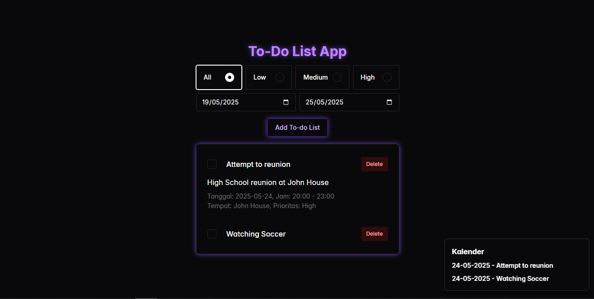

# 📝 To-Do List App

A simple yet complete To-Do List application, designed to help you manage your daily tasks efficiently. This app now includes powerful features like checklists, task priorities, filtering, reminders, and a mini calendar — all added without changing the familiar look and feel of the original interface.


---

## 🌐 Live Demo

Example: [View Demo](https://put-todolist.netlify.app)

---

## ✨ Key Features

- ✅ **Completion Checklist**  
  Easily mark tasks as completed with a single click.

- ⏫ **Task Priority**  
  Set task priority as *high*, *medium*, or *low* to stay focused.

- 🔍 **Filter & Search**  
  Filter tasks by status (done/pending) or by priority level. Search tasks by keyword for quick access.

- ⏰ **Reminders**  
  Add customizable reminders to stay on top of your deadlines.

- 📅 **Mini Calendar**  
  Browse and manage tasks by date using an interactive mini calendar view.

---

## 🧱 Tech Stack

- **Frontend**: React.JS
- **Backend**: - (Client-side only)
- **Database**: LocalStorage (no external database required)

---

## 🚀 Installation & Usage

### 🔧 1. Clone the Repository

```bash
git clone https://github.com/username/todo-list-app.git
cd todo-list-app
```

### 🖥️ 2. Run Locally
```bash
npm install
npm run dev
```

The app will start running on http://localhost:5173 (or another port, depending on your setup).
